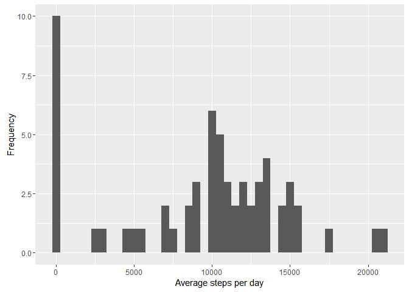
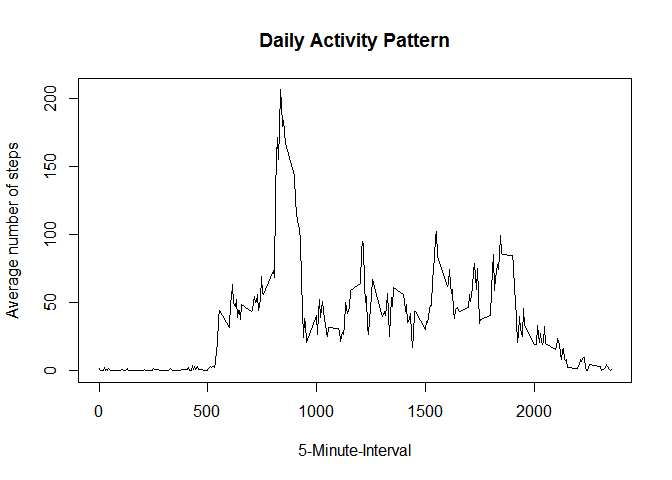
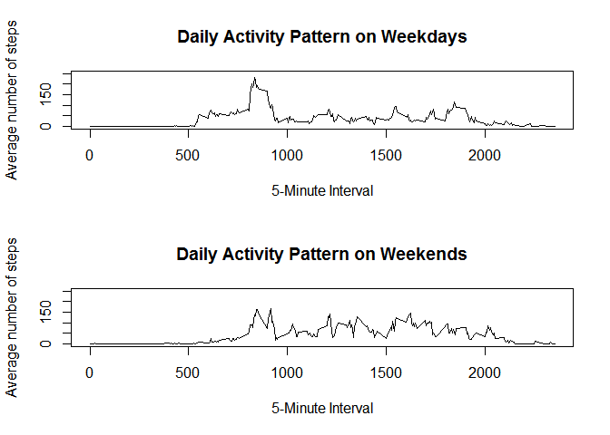

Reproducible Research: Peer Assessment 1
================

``` r
library(lubridate)
```

    ## 
    ## Attaching package: 'lubridate'

    ## The following object is masked from 'package:base':
    ## 
    ##     date

``` r
library(ggplot2)
library(data.table)
```

    ## 
    ## Attaching package: 'data.table'

    ## The following objects are masked from 'package:lubridate':
    ## 
    ##     hour, mday, month, quarter, wday, week, yday, year

Loading and Preprocessing the Data
----------------------------------

### 1.Load the data in R

``` r
file <- read.csv("activity.csv", stringsAsFactors = FALSE)
```

### 2.Processing the data

``` r
file$date <- as.Date(file$date)
file$interval <- as.factor(file$interval)
str(file)
```

    ## 'data.frame':    17568 obs. of  3 variables:
    ##  $ steps   : int  NA NA NA NA NA NA NA NA NA NA ...
    ##  $ date    : Date, format: "2012-10-01" "2012-10-01" ...
    ##  $ interval: Factor w/ 288 levels "0","5","10","15",..: 1 2 3 4 5 6 7 8 9 10 ...

What is the mean total number of steps taken per day?
-----------------------------------------------------

``` r
steps_per_day <- tapply(file$steps, file$date, sum, na.rm=TRUE)
```

### 1. Plot histogram of the meand number of steps per day

``` r
qplot(steps_per_day, xlab='Average steps per day',ylab='Frequency', binwidth=500)
```



### 2. Mean and median total number of steps

``` r
Steps_per_day_mean <- mean(steps_per_day, na.rm=TRUE)
Steps_per_day_median <- median(steps_per_day, na.rm=TRUE)
Steps_per_day_mean
```

    ## [1] 9354.23

``` r
Steps_per_day_median
```

    ## [1] 10395

What is the daily average activity pattern?
-------------------------------------------

### 1. Mean total number of steps per interval

``` r
daily_steps_per_interval_mean <- tapply(file$steps, file$interval, mean,na.rm=TRUE)
```

### 2. Plot of total mean number of steps in each interval

``` r
plot(y = daily_steps_per_interval_mean, x = names(daily_steps_per_interval_mean), type = "l", xlab = "5-Minute-Interval", 
     main = "Daily Activity Pattern", ylab = "Average number of steps")
```



### 3. The interval in which maximum number of steps taken are :

``` r
daily_steps_per_interval_mean[daily_steps_per_interval_mean==max(daily_steps_per_interval_mean)]
```

    ##      835 
    ## 206.1698

Imputing Missing Values
-----------------------

### 1.Total Number of missing values

``` r
num_missing_values <- length(which(is.na(file$steps)))
num_missing_values
```

    ## [1] 2304

### 2.Imputing Missing values

``` r
act_new <- file
act_new[which(is.na(act_new$steps)),1]<-
  daily_steps_per_interval_mean[as.character(act_new[which(is.na(act_new$steps)),3])]
```

Are there any differences in activity patterns between weekdays and weekends?
-----------------------------------------------------------------------------

### 1.Segregating the data into weekdays and weekends

``` r
act_new$wd<-weekdays(act_new$date)
act_new$fwd<- as.factor(c("weekend", "weekday"))
act_new[act_new$wd == "Sunday" | act_new$wd == "Saturday" ,5]<- factor("weekend")
act_new[!(act_new$wd == "Sunday" | act_new$wd == "Saturday"),5 ]<- factor("weekday")


act_new_we <- subset(act_new, fwd == "weekend") 
act_new_wd <- subset(act_new, fwd == "weekday") 
daily_steps_per_interval_mean_we<-tapply(act_new_we$steps, act_new_we$interval, mean)
daily_steps_per_interval_mean_wd<-tapply(act_new_wd$steps, act_new_wd$interval, mean)
```

### 2.Difference between steps taken in weekdays and weekends

``` r
par(mfrow=c(2,1))
plot(y = daily_steps_per_interval_mean_wd, x = names(daily_steps_per_interval_mean_wd), type = "l", xlab = "5-Minute Interval", 
     main = "Daily Activity Pattern on Weekdays", ylab = "Average number of steps", 
     ylim =c(0, 250))
plot(y = daily_steps_per_interval_mean_we, x = names(daily_steps_per_interval_mean_we), type = "l", xlab = "5-Minute Interval", 
     main = "Daily Activity Pattern on Weekends", ylab = "Average number of steps", 
     ylim =c(0, 250))
```


